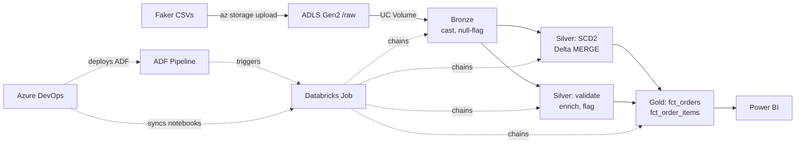

# retail-azure-de-project

A production-shaped batch pipeline on Azure: **ADF → Databricks (medallion, Unity Catalog) → Power BI**,
deployed via **Azure DevOps CI/CD**. Faker-generated retail data with deliberately injected data-quality
and business-logic defects, so the transform layer has real problems to solve rather than clean toy data.

This is a rebuild of an equivalent BigQuery/dbt/Airflow project — same data, same business logic,
re-architected around what's actually idiomatic on Azure rather than a lift-and-shift of the old stack.
See [comparison](#coming-from-bigquerydbtairflow) below.

---

## Architecture



**Two nested orchestration layers, intentionally kept separate:**
- **ADF** triggers the Databricks Job as one opaque unit — it has no visibility into what's inside
- **Databricks Workflows** chains the four notebook tasks with explicit dependencies (the dbt-DAG
  equivalent, minus `ref()`-inference — dependencies are declared, not derived)

**CI/CD** deploys both halves on push to `main`: ADF's ARM template (from its `adf_publish` branch)
and a `databricks repos update` to pull the latest notebooks.

---

## Stack

| Layer | Tool | Notes |
|---|---|---|
| Storage | ADLS Gen2 | Hierarchical namespace; separate containers per medallion layer |
| Governance | Unity Catalog | Auto-provisioned metastore; explicit external locations + managed schemas per layer |
| Orchestration (outer) | Azure Data Factory | Single Job-trigger activity; auth via managed identity, no stored credential |
| Orchestration (inner) | Databricks Workflows | 4-task chain: bronze → silver_scd2 → silver_transform → gold |
| Compute / transform | PySpark on Serverless | No dbt — native Delta MERGE for SCD2, plain PySpark for the rest |
| CI/CD | Azure DevOps Pipelines | Federated identity for ADF deploy; PAT (secret variable) for Databricks sync — see [tradeoffs](#things-i-chose-not-to-fix) |
| BI | Power BI | [TBD] |

---

## What's engineered here, not just wired together

**Unity Catalog set up deliberately, not defaulted.** New Databricks workspaces auto-provision a
metastore with no storage root — the path of least resistance is Databricks' own "Default Storage,"
which is serverless-only and opaque. Instead: an Access Connector (managed identity) → explicit
external locations per medallion layer → managed schemas — the same pattern a real Azure environment
uses, not a shortcut around it.

**SCD2 via Delta MERGE, not a borrowed dbt pattern.** dbt's `snapshot` diffs a *live source* against
the *last snapshot*. Here, bronze itself carries no history (overwritten every run) — so silver
compares this run's bronze snapshot against its own currently-open row per key, in two MERGE steps
(close changed rows, then insert new versions), reading from one consistent snapshot of "current"
taken before either step runs. `valid_to` uses the new row's source timestamp, not wall-clock, to
stay semantically comparable to the dbt version it replaces.

**Data defects are deliberately preserved, not cleaned away.** Invalid order lines (negative
qty/price, orphaned product FKs), settlement-before-payment sequencing bugs, and orphaned returns are
flagged and carried through bronze → silver, only filtered where the business logic actually requires
it (e.g. `fct_order_items` excludes invalid lines *on purpose* — a "bad" order's total deliberately
understates its true value, matching a real finance-team requirement rather than silently fixing bad
data).

**No-secret auth, applied consistently, with one documented exception.** Every Azure-service-to-
Databricks connection (storage access connector, ADF's linked service, DevOps' ADF deploy) uses
managed identity / workload identity federation — zero stored credentials. The one deviation
(Databricks Repos sync uses a PAT via an encrypted DevOps secret variable) is a documented, deliberate
tradeoff, not an oversight — see below.

---

## Things I chose not to fix

Every real project has these. Naming them beats hiding them.

- **Databricks Repos sync uses a PAT, not federated identity.** The Databricks CLI's Azure-CLI-auth
  bridge (inheriting an ephemeral build agent's `az login` session) failed unreliably with generic
  Entra credential errors — a maturity gap in that specific tool, not a permissions problem (the
  federated identity's grants were confirmed correct via other paths). PAT-via-encrypted-secret-
  variable is the pragmatic fallback; worth revisiting as the tooling matures.
- **Point-in-time dimension joins are deferred.** `orders_enriched` joins against the *current*
  customer/product state, not an asof join against SCD2 history at order time. The SCD2 tables and
  the scaffolding to do this correctly both exist; the join itself isn't built.
- **No automated tests beyond inline PySpark assertions.** Row-count and null-rate checks run inline
  per notebook; no dbt-style schema test framework or CI-gated data tests.
- **ADF pipeline currently has one activity.** It's structurally capable of pre/post-check chaining
  (file-arrival validation, failure notifications) but doesn't do any of that yet — there's nothing to
  chain because the multi-step logic already lives one layer down, in Databricks Workflows.

---

## Coming from BigQuery/dbt/Airflow

| Old stack | Azure equivalent | What changed |
|---|---|---|
| Airflow (single orchestrator) | ADF + Databricks Workflows (two nested layers) | Orchestration genuinely split across two products |
| dbt `ref()`-inferred DAG | Databricks Workflows, explicit task dependencies | Declared, not inferred |
| dbt `snapshot` (SCD2) | Delta `MERGE`, two-step | Same intent, native mechanism |
| BigQuery SQL models | PySpark + Delta Lake | SQL-first → dataframe-first |
| dbt schema tests | Inline PySpark assertions | Lighter, less structured |
| Local Airflow + Docker Compose | Azure DevOps Pipelines (federated identity + one PAT) | Deploy step now genuinely CI/CD, not a local trigger |

---

## Repo structure

```
data_generator/          Faker generation, deliberate DQ/business-logic defects
databricks_notebooks/    bronze_ingest, silver_scd2, silver_transform, gold_aggregate
adf/                     ADF pipeline JSON (git-managed, synced via ADF's native Git integration)
azure-pipelines.yml      CI/CD: ARM deploy + Databricks Repos sync, on push to main
docs/BUILD_NOTES.md      Full step-by-step build log, including the debugging trail
```

## Running it

Full provisioning steps, exact resource names, and the complete troubleshooting trail are in
[`docs/BUILD_NOTES.md`](docs/BUILD_NOTES.md). Short version: provision ADLS Gen2 + Databricks
(Premium) + ADF via the Azure CLI, wire Unity Catalog (Access Connector → external locations →
managed schemas), run the four notebooks as a chained Databricks Job, point one ADF pipeline at it,
connect both to a shared Azure DevOps repo, and let the YAML pipeline handle deploys from there.